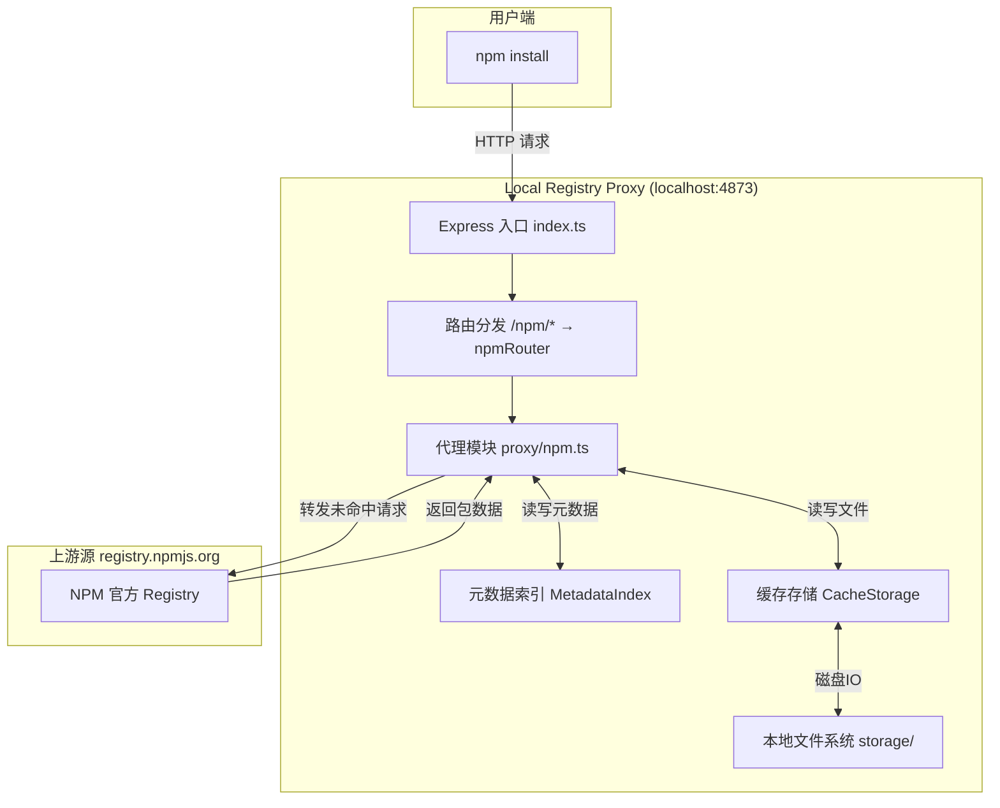
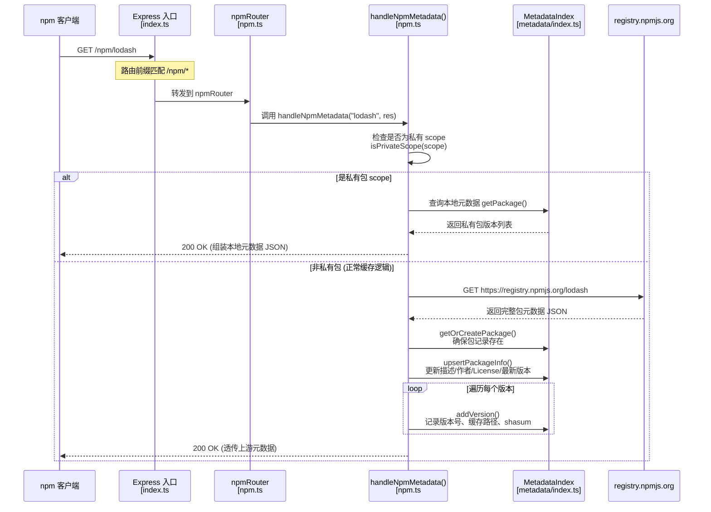
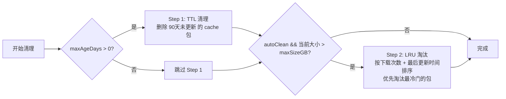

# Local Registry Proxy

本地私有 NPM / PyPI 镜像代理缓存系统。

## 功能特性

- 🚀 **代理转发**: 代理 NPM 和 PyPI 官方仓库请求
- 💾 **智能缓存**: 缓存安装过的包到本地，下次直接走本地
- 📦 **私有包管理**: 支持 scope 隔离的私有包上传和版本管理
- 📊 **管理面板**: Web 界面查看缓存包、统计信息、配置策略
- 🧹 **灵活清理**: 手动清理单个包或按策略自动清理

## 项目结构

```
.
├── server/          # 后端服务 (Express + TypeScript)
│   └── src/
│       ├── modules/
│       │   ├── proxy/          # 代理转发模块 (npm.ts, pypi.ts, utils.ts)
│       │   ├── cache/          # 缓存存储模块 (index.ts - CacheStorage)
│       │   ├── private-pkg/    # 私有包管理模块 + 管理 API
│       │   └── metadata/       # 元数据索引模块 (MetadataIndex - JSON 数据库)
│       ├── config.ts           # 全局配置
│       ├── types.ts            # 类型定义
│       ├── utils.ts            # 工具函数
│       └── index.ts            # Express 入口，路由分发
├── client/          # 前端管理面板 (React + Vite)
└── storage/         # 包文件存储目录 (运行时生成)
```

---

## 🔍 包缓存工作流程完整解析

### 1. 整体架构概览



---

### 2. npm install 请求分阶段解析

执行 `npm install lodash` 时，npm 客户端实际上会发起**两类请求**：

| 阶段 | 请求路径 | 作用 | 处理函数 |
|------|----------|------|----------|
| ① 获取元数据 | `GET /npm/lodash` | 获取包的所有版本信息、依赖列表、各版本 tarball 的下载地址 | `handleNpmMetadata()` |
| ② 下载 tarball | `GET /npm/lodash/-/lodash-4.17.21.tgz` | 下载实际的 `.tgz` 包二进制文件 | `handleNpmTarball()` |

> **关键注意**：缓存判断的核心逻辑发生在 **第②阶段**（tarball 下载），而不是元数据获取阶段。元数据始终从上游源获取，以保证版本列表是最新的。

---

### 3. 阶段一：元数据请求流程



**关键代码位置**：
- 路由注册：[index.ts#L23](file:///d:/code/gy/64/64-未归类-22/64-未归类-22/server/src/index.ts#L23)
- 元数据路由：[npm.ts#L86-L93](file:///d:/code/gy/64/64-未归类-22/64-未归类-22/server/src/modules/proxy/npm.ts#L86-L93)
- `handleNpmMetadata()` 函数：[npm.ts#L113-L155](file:///d:/code/gy/64/64-未归类-22/64-未归类-22/server/src/modules/proxy/npm.ts#L113-L155)

---

### 4. 阶段二：Tarball 下载 —— 缓存命中 vs 缓存未命中

这是整个缓存系统的**核心环节**。下面用分叉流程图详细展示两种路径。

```mermaid
flowchart TD
    START([客户端请求<br/>GET /npm/lodash/-/lodash-4.17.21.tgz])
    --> ROUTE[Express → npmRouter<br/>npm.ts#L47-L55]
    --> PARSE[解析参数<br/>packageName='lodash'<br/>filename='lodash-4.17.21.tgz']
    --> EXTRACT[从文件名提取 version<br/>regex: /-\d+\.\d+[^-]*\.tgz$/ <br/>得到 version='4.17.21']
    --> BUILDPATH[构造本地缓存路径<br/>cache.getNpmCachePath()<br/>→ storage/npm/cache/lodash/4.17.21/lodash-4.17.21.tgz]
    --> CHECK{缓存文件是否存在?<br/>cache.fileExists(cachePath)}

    %% ============ 缓存命中分支 ============
    CHECK -->|是 (文件存在)| HIT1[⭐ 缓存命中 CACHE HIT]
    HIT1 --> HIT2[metadata.incrementVersionDownload()<br/>包+版本下载计数 +1]
    HIT2 --> HIT3[设置响应头:<br/>• X-Cache: HIT<br/>• Content-Length: 文件大小<br/>• Content-Type: application/octet-stream]
    HIT3 --> HIT4[cache.readStream(cachePath).pipe(res)<br/>流式读取本地文件直接输出]
    HIT4 --> END_HIT([客户端收到响应<br/>✓ 无网络请求到上游])

    %% ============ 缓存未命中分支 ============
    CHECK -->|否 (文件不存在)| MISS1[❌ 缓存未命中 CACHE MISS]
    MISS1 --> MISS2[构造上游 URL:<br/>https://registry.npmjs.org/lodash/-/lodash-4.17.21.tgz]
    MISS2 --> MISS3[makeRequest() 发起 HTTP 请求<br/>proxy/utils.ts#L11-L72<br/>30s 超时 + 硬超时保护]
    MISS3 --> MISS_CHECK{上游响应状态码?}

    MISS_CHECK -->|非 200 (404/500等)| ERR1[透传上游错误<br/>res.status(code).send(body)]
    ERR1 --> END_ERR([客户端收到错误响应])

    MISS_CHECK -->|200 OK| MISS4[★ 保存到本地缓存<br/>cache.writeFile(cachePath, response.body)<br/>同步写入磁盘]
    MISS4 --> MISS5[metadata.getOrCreatePackage()<br/>确保包在索引中存在]
    MISS5 --> MISS6[metadata.addVersion()<br/>写入: version / 文件大小 / 缓存路径 / sha1]
    MISS6 --> MISS7[metadata.incrementVersionDownload()<br/>下载计数 +1]
    MISS7 --> MISS8[设置响应头:<br/>• X-Cache: MISS<br/>• Content-Length: 响应体长度<br/>• Content-Type: 上游返回的类型]
    MISS8 --> MISS9[res.send(response.body)<br/>将 Buffer 返回给客户端]
    MISS9 --> END_MISS([客户端收到响应<br/>同时本地已缓存该文件])
```

---

### 5. 缓存命中 (Cache HIT) 详细链路

#### 数据流向

```
客户端  ──GET /npm/lodash/-/lodash-4.17.21.tgz──▶  Express
                                                       │
                  ┌────────────────────────────────────┘
                  ▼
          handleNpmTarball("lodash", "lodash-4.17.21.tgz")
                  │
                  ├─▶ 解析 version = "4.17.21"
                  │
                  ├─▶ cache.getNpmCachePath()
                  │      │
                  │      └─▶ 返回: <storageDir>/npm/cache/lodash/4.17.21/lodash-4.17.21.tgz
                  │
                  ├─▶ cache.fileExists(cachePath) ──▶ fs.existsSync()
                  │      │
                  │      └─▶ true (文件存在!)
                  │
                  ├─▶ metadata.incrementVersionDownload(pkgId, "4.17.21")
                  │      │
                  │      └─▶ DB: downloadCount++ + scheduleSave()
                  │
                  ├─▶ 设置响应头
                  │      X-Cache: HIT           ← 客户端可识别的缓存标记
                  │      Content-Length: 123456
                  │      Content-Type: application/octet-stream
                  │
                  └─▶ cache.readStream(cachePath).pipe(res)
                         │
                         └─▶ fs.createReadStream() ──流式输出──▶ 客户端
```

#### 核心代码片段说明

**步骤 1：构造缓存路径**  
代码位置：[cache/index.ts#L31-L36](file:///d:/code/gy/64/64-未归类-22/64-未归类-22/server/src/modules/cache/index.ts#L31-L36)

```typescript
getNpmCachePath(packageName: string, version: string, filename: string): string {
  const safeName = sanitizePath(packageName);     // 路径安全清洗
  const dir = path.join(this.npmCacheDir, safeName, sanitizePath(version));
  ensureDir(dir);                                  // 确保目录存在
  return path.join(dir, sanitizePath(filename));
}
```

**步骤 2：文件存在性检查 + 流式返回**  
代码位置：[npm.ts#L171-L183](file:///d:/code/gy/64/64-未归类-22/64-未归类-22/server/src/modules/proxy/npm.ts#L171-L183)

```typescript
if (cachePath && cache.fileExists(cachePath)) {
  const pkg = metadata.getPackage(packageName, 'npm');
  const pkgId = pkg ? metadata.getOrCreatePackage(packageName, 'npm', 'cache') : 0;
  if (pkg && version) {
    metadata.incrementVersionDownload(pkgId, version);    // 下载计数+1
  }
  const fileSize = cache.getFileSize(cachePath);
  res.setHeader('Content-Length', fileSize.toString());
  res.setHeader('Content-Type', 'application/octet-stream');
  res.setHeader('X-Cache', 'HIT');                        // 标记 HIT
  cache.readStream(cachePath).pipe(res);                  // 流式输出
  return;
}
```

**步骤 3：文件流式读取**  
代码位置：[cache/index.ts#L66-L68](file:///d:/code/gy/64/64-未归类-22/64-未归类-22/server/src/modules/cache/index.ts#L66-L68)

```typescript
readStream(filePath: string): fs.ReadStream {
  return fs.createReadStream(filePath);  // 零拷贝，不占用额外内存
}
```

---

### 6. 缓存未命中 (Cache MISS) 详细链路

#### 数据流向

```
客户端  ──GET──▶  Express
                     │
                     ▼
           handleNpmTarball()
                     │
                     ├─▶ 构造缓存路径
                     ├─▶ cache.fileExists() ──▶ false (不存在!)
                     │
                     │  ╔══════════════════════════════════╗
                     │  ║  ★  发起上游源请求 (makeRequest)  ║
                     │  ╚══════════════════════════════════╝
                     │         │
                     │         ▼
                     │   https://registry.npmjs.org/lodash/-/lodash-4.17.21.tgz
                     │         │
                     │         ▼
                     │   接收响应 Buffer (tgz 二进制)
                     │
                     ├─▶ cache.writeFile(cachePath, response.body)
                     │      │
                     │      └─▶ fs.writeFileSync() 写入磁盘 ✓
                     │
                     ├─▶ metadata.getOrCreatePackage() ──▶ 创建或获取包ID
                     │
                     ├─▶ metadata.addVersion()
                     │      │
                     │      └─▶ DB 写入: version, size, filePath, sha1
                     │
                     ├─▶ metadata.incrementVersionDownload()
                     │
                     ├─▶ 设置响应头
                     │      X-Cache: MISS
                     │      Content-Length: ...
                     │
                     └─▶ res.send(response.body) ──▶ 客户端
```

#### 核心代码片段说明

**步骤 1：上游 HTTP 请求（带双层超时保护）**  
代码位置：[proxy/utils.ts#L11-L72](file:///d:/code/gy/64/64-未归类-22/64-未归类-22/server/src/modules/proxy/utils.ts#L11-L72)

```typescript
export function makeRequest(urlStr: string, options = {}): Promise<UpstreamResponse> {
  const timeoutMs = options.timeout || 30000;

  const reqPromise = new Promise<UpstreamResponse>((resolve, reject) => {
    const url = new URL(urlStr);
    const lib = url.protocol === 'https:' ? https : http;

    const req = lib.request({
      hostname: url.hostname,
      port: url.port,
      path: url.pathname + url.search,
      method: 'GET',
      headers: {
        'User-Agent': 'local-registry-proxy/1.0',
        Accept: '*/*',
      },
      timeout: timeoutMs,           // 第一层: socket 超时
    }, (res) => {
      const chunks: Buffer[] = [];
      res.on('data', (chunk) => chunks.push(chunk));
      res.on('end', () => resolve({
        statusCode: res.statusCode || 500,
        headers: res.headers,
        body: Buffer.concat(chunks),   // 完整 Buffer
      }));
    });

    req.on('error', reject);
    req.on('timeout', () => req.destroy(new Error('Request timeout')));
    req.end();
  });

  // 第二层: Promise.race 硬超时，防止挂死
  return Promise.race([
    reqPromise,
    new Promise((_, reject) => {
      const t = setTimeout(() => {
        clearTimeout(t);
        reject(new Error(`Request hard timeout after ${timeoutMs + 200}ms`));
      }, timeoutMs + 200);
    }),
  ]);
}
```

**步骤 2：保存到本地缓存 + 更新元数据 + 返回响应**  
代码位置：[npm.ts#L185-L205](file:///d:/code/gy/64/64-未归类-22/64-未归类-22/server/src/modules/proxy/npm.ts#L185-L205)

```typescript
const upstreamUrl = `${config.npm.upstream}/${encodeURIComponent(packageName)}/-/${filename}`;
const response = await makeRequest(upstreamUrl);

if (response.statusCode !== 200) {
  res.status(response.statusCode);
  res.send(response.body);   // 错误透传
  return;
}

// 成功: 先写磁盘，再写索引，最后返回
if (cachePath && version) {
  cache.writeFile(cachePath, response.body);                  // 1. 落盘
  const pkgId = metadata.getOrCreatePackage(packageName, 'npm', 'cache', scope);  // 2. 建包
  metadata.addVersion(pkgId, version, response.body.length, cachePath);  // 3. 建版本
  metadata.incrementVersionDownload(pkgId, version);          // 4. 计数
}

res.setHeader('Content-Length', response.body.length.toString());
res.setHeader('Content-Type', response.headers['content-type'] || 'application/octet-stream');
res.setHeader('X-Cache', 'MISS');                             // 标记 MISS
res.send(response.body);                                      // 返回给客户端
```

---

### 7. 两大核心模块详解

#### 7.1 CacheStorage —— 文件存储层

代码位置：[cache/index.ts](file:///d:/code/gy/64/64-未归类-22/64-未归类-22/server/src/modules/cache/index.ts)

**职责**：所有与磁盘文件系统的交互都通过此类完成，不暴露底层 fs API。

**目录结构**：
```
<storageDir>/
├── npm/
│   ├── cache/               # 公共缓存包
│   │   └── <sanitizedName>/
│   │       └── <version>/
│   │           └── <filename>.tgz
│   └── private/             # 私有发布包
│       └── <scope>/
│           └── <sanitizedName>/
│               └── <version>/
│                   └── <filename>.tgz
├── pypi/
│   └── cache/               # PyPI 缓存包
│       └── <sanitizedName>/
│           └── <version>/
│               └── <filename>
└── tmp/                     # 临时文件 (24h 自动清理)
    └── <timestamp>-<filename>
```

**核心方法速查表**：

| 方法 | 作用 |
|------|------|
| `getNpmCachePath()` | 构造 NPM 缓存包路径 |
| `getNpmPrivatePath()` | 构造 NPM 私有包路径 |
| `fileExists()` | 调用 `fs.existsSync()` 判断文件是否存在 → **缓存命中判断入口** |
| `getFileSize()` | 调用 `fs.statSync()` 获取文件大小 |
| `readStream()` | `fs.createReadStream()` → **命中时流式传输** |
| `writeFile()` | `fs.writeFileSync()` → **未命中时写入磁盘** |
| `writeStream()` | `fs.createWriteStream()` (流式写入) |
| `deleteFile()` | 删除文件 + 自动清理空目录 |
| `runCacheCleanup()` | 根据策略 (maxAgeDays + maxSizeGB) 清理缓存 |
| `cleanupTemp()` | 清理超过 24 小时的临时文件 |

#### 7.2 MetadataIndex —— 元数据索引层

代码位置：[metadata/index.ts](file:///d:/code/gy/64/64-未归类-22/64-未归类-22/server/src/modules/metadata/index.ts)

**职责**：维护所有包/版本的元数据关系数据库，持久化到 JSON 文件，类似轻量级 SQLite。

**存储文件**：`<dataDir>/registry-data.json`

**数据结构**（简化版）：

```json
{
  "nextPackageId": 42,
  "nextVersionId": 128,
  "packages": [
    {
      "id": 1,
      "name": "lodash",
      "registry": "npm",
      "source": "cache",           // 'cache' | 'private' | 'upstream'
      "description": "Lodash modular utilities",
      "latestVersion": "4.17.21",
      "totalSize": 1387504,
      "downloadCount": 156,
      "createdAt": 1718900000000,
      "updatedAt": 1718999999999
    }
  ],
  "versions": [
    {
      "id": 1,
      "packageId": 1,
      "version": "4.17.21",
      "size": 1387504,
      "filePath": "D:\\...\\storage\\npm\\cache\\lodash\\4.17.21\\lodash-4.17.21.tgz",
      "sha1": "7202d4...",
      "publishedAt": 1718900000000,
      "downloadCount": 156
    }
  ],
  "storageTrend": [
    { "date": "2024-06-22", "size": 524288000, "packages": 32 }
  ],
  "cachePolicy": {
    "maxSizeGB": 50,
    "maxAgeDays": 90,
    "autoClean": true
  }
}
```

**保存策略**：**防抖写入**（debounce 200ms），避免频繁 IO。  
代码位置：[metadata/index.ts#L89-L95](file:///d:/code/gy/64/64-未归类-22/64-未归类-22/server/src/modules/metadata/index.ts#L89-L95)

```typescript
private scheduleSave(): void {
  if (this.saveTimer) return;
  this.saveTimer = setTimeout(() => {
    this.saveTimer = null;
    this.persist();     // 真正写入 JSON 文件
  }, 200);              // 200ms 内多次修改只写一次
}
```

---

### 8. 缓存清理策略（LRU + TTL 组合）

代码位置：[cache/index.ts#L131-L169](file:///d:/code/gy/64/64-未归类-22/64-未归类-22/server/src/modules/cache/index.ts#L131-L169)

当 `runCacheCleanup()` 被调用时，执行两步清理：



**Step 2 淘汰排序逻辑**（类 LRU）：
```typescript
.sort((a, b) =>
  a._downloads - b._downloads     // 先比下载次数 (少的先淘汰)
  || a._updated - b._updated      // 下载次数相同再比最后更新时间 (早的先淘汰)
)
```

---

### 9. 响应头约定

| Header | 值 | 含义 |
|--------|----|------|
| `X-Cache` | `HIT` | 文件来自本地缓存，无上游网络请求 |
| `X-Cache` | `MISS` | 文件来自上游源，已同步写入本地缓存 |
| `Content-Type` | `application/octet-stream` | tarball 二进制文件 |
| `Content-Length` | `<bytes>` | 文件大小，便于客户端显示进度 |

---

## 快速开始

```bash
# 安装依赖
npm run install:all

# 开发模式 (同时启动前后端)
npm run dev

# 生产构建
npm run build

# 启动服务
npm start
```

## NPM 使用

```bash
# 设置 registry
npm config set registry http://localhost:4873/npm

# 或者临时使用
npm install --registry http://localhost:4873/npm <package-name>

# 发布私有包 (scope: @myorg)
npm publish --registry http://localhost:4873/npm
```

## PIP 使用

```bash
# 使用镜像
pip install -i http://localhost:4873/pypi/simple/ <package-name>

# 或者配置到 pip.conf
pip config set global.index-url http://localhost:4873/pypi/simple/
```

## Web 管理界面

访问: http://localhost:4873
